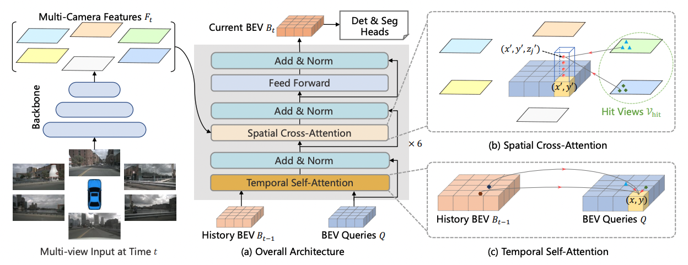
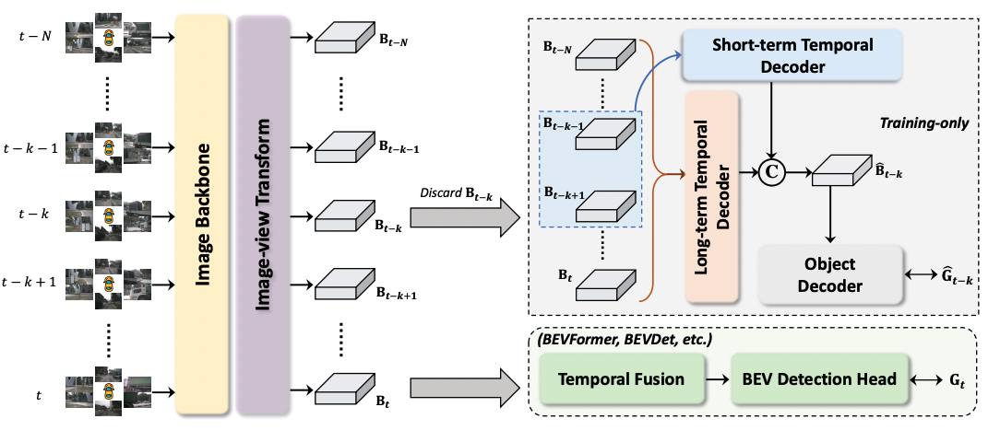

# Bird’s-Eye View from Monocular Cameras: Group 3

- Group number: 3
- Group Member:
    1. Mery Tom, **SCIPER: 297217** (tom.mery@epfl.ch)
    1. Charfeddine Ramy, **SCIPER: 295758** (ramy.charfeddine@epfl.ch)

* [Abstract](#abstract)
* [Methods](#methods)
* [Contribution](#contribution)
* [Getting Started](#getting-started)
    * [Installation](#getting-started)
    * [Dataset and Weights](#getting-started)
    * [Run and Eval](#getting-started)
* [Experiments](#experiments)
* [Results](#results)
* [Conclusion](#conclusion)

# Abstract
The objective is to develop a deep learning
model that can transform monocular camera images of the
surrounding into a bird’s eye view map. The output of the
model will be bird’s eye view map that can be used to train
the object detection, tracking and predictions algorithms
of the Tesla Autopilot system. Detailed introduction, litterature review and problem statement are available in `milestone1.pdf`.


# Methods
> **BEVFormer: Learning Bird's-Eye-View Representation from Multi-Camera Images via Spatiotemporal Transformers**, ECCV 2022
> - [Paper in arXiv](http://arxiv.org/abs/2203.17270), 13 Jul 2022

BEVFormer models have been shown to
achieve state-of-the-art performance on a variety of
benchmarks for BEV map generation in autonomous
driving applications. This model consists of a convolutional
neural network (CNN) backbone that extracts
features from the input images and a
transformer-based architecture that converts
these features into a top-down representation
of the surrounding environment. The overall
architecture of BEVFormer is shown in bellow:


*Figure 1: BEVFormer architecture*

This repository is based on the official implementation of BEVFormer available here: https://github.com/fundamentalvision/BEVFormer.

Recall that in the context of our project, (i.e. building Tesla Autopilot system) we are only interested in extracing a bird-eye-view features map from surrounding cameras. From the figure above we therefore only want to extract BEV *Bt* that will be fed into downstream tasks (i.e. trajectories prediction and sim agents). However, to assess the quality of the BEV features map, it is more convenient to tie it up with 3d detection tasks or segmentation tasks. Here, only 3d detection is used.

# Contribution
> **Temporal Enhanced Training of Multi-view 3D Object Detector via Historical
Object Prediction**
> - [Paper in arXiv](https://arxiv.org/abs/2304.00967), 3 Apr 2023

Very recent paper above comes up with a new
paradigm, named Historical Object Prediction
(HoP) for multi-view 3D detection to leverage
temporal information more effectively. The overall
architecture of HoP is shown in bellow: 


*Figure 2: Historical Object Prediction (HoP) architecture*

This method allows state-of-the-art architectures to perform even better by generating a pseudo BEV
feature map of timestamp *(t−k)* from its adjacent
frames and utilize this feature to predict the object
set at timestamp *(t−k)*. HoP is performed only during
training and thus, does not introduce extra overheads
during inference. HoP is described as a plug-and-play approach and can be easily incorporated into
state-of-the-art BEV detection frameworks including BEVFormer.
As the paper is very recent, the implementation is
yet not available and therefore the main contribution
of this repo is the implementation of the proposed
HoP method including it to the BEVFormer model.

Our implementation of HoP can be found at [projects/mmdet3d_plugin/hop](projects/mmdet3d_plugin/hop) and is as follow:

```
├── hop/
    ├── __init__.py
    ├── detectors/
        ├── __init__.py
        ├── bevformer_hop.py/
    ├── modules/
        ├── __init__.py
        ├── hop.py/
        ├── object_decoder.py/
        ├── temporal_decoder.py/
```

**HoP** framework is implemented as a `torch.nn.Module` in [hop.py](projects/mmdet3d_plugin/hop/modules/hop.py). The **TemporalEncoder** that combines the outputs of both **ShortTermTemporalDecoder** and **LongTermTemporalDecoder** is implemented in [temporal_decoder.py](projects/mmdet3d_plugin/hop/modules/temporal_decoder.py). For the theoritical background behind the implementation, please refer to the original [paper](https://arxiv.org/pdf/2304.00967.pdf). We have chosen to reuse the object detection head (aka. DetectionTransformerDecoder) of the existing BEVFormer as the **ObjectDecoder** (implemented in [object_decoder.py](projects/mmdet3d_plugin/hop/modules/object_decoder.py)) module in the **HoP** framework.

The **HoP** framework is then plugged to BEVFormer in [bevformer_hop.py](projects/mmdet3d_plugin/hop/detectors/bevformer_hop.py) which implements the main class **BEVFormer_HoP**. Implementation of the forward pass using HoP, called `forward_hop()` and `forward_train()` as well as custom initialization from existing pre-trained weights is added to the exisiting **BEVFormer** class.
Then **BEVFormer_HoP** is register to the detectors registry to comply with the existing repo of BEVFormer implemented using [OpenMMLab](https://github.com/open-mmlab).


# Getting Started
- [Installation](docs/install.md) 
- [Dataset and Weights](docs/dataset.md)
- [Run and Eval](docs/run.md)

# Experiments
Recall that the main hypothesis behing HoP framework is that enforcing the detector to capture both the spatial location and temporal motion of objects occurring at historical timestamps can lead to more accurate BEV feature learning. The following experiments are here to check the sanity of our implementation as well as validating the main hypothesis.

Given the time and computational ressources limitations in the context of this project, here are the procedure used to obtain the results given bellow:

- `Step 1`: Only the tiny versions of BEVFormer, i.e. ResNet-50 instead of ResNet-101 as backbone and BEV feature map with shape 50x50 instead of 200x200, is considered. Existing pre-trained weights are loaded, see [ckpts](https://drive.switch.ch/index.php/s/dvADSm42HRxoi0f?path=%2Fckpts).
- `Step 2`: To get a decent weight initialization of HoP framework, we first only train the temporal and object decoder of HoP. To do so, from *Figure 2*, the image backbone as well as the image-view transform from the existing BEVFormer is freezed. Then, given the historical BEV feature maps from timestep *t*, the HoP branch is trained to generate the BEV maps of timestamp *(t-k)* from its adjacent frames and utilize this feature to predict the object set at timestamp *(t-k)*.
- `Step 3`: From the weights of the HoP branch obtained after step 2, the image-view transform is unfreezed and BEVFormer is trained using both the prediction of the HoP branch and the prediction of the original BEV detection head. This is done by linear combination of the losses coming from both detection heads.

Finally, since we are training the models from pre-trained weights, the learning rate schedule is modify in consequence. Warmup steps are removed and the learning rate is decreased by a factor of 20. 

To reproduce `step 2` on the full dataset using 2 GPUs, run:
```
./tools/dist_train.sh ./projects/configs/bevformer_hop/bevformer_tiny_hop_only.py 2
```
We provide the logs of step 2. To visualize how the training went, run:
```
tensorboard --logdir=experiments/bevformer_tiny_hop_only/ --bind_all
```

To reproduce `step 3` on the full dataset, using 2 GPUs, with a weight of 0.25 for the HoP branch, run:
```
./tools/dist_train.sh ./projects/configs/bevformer_hop/bevformer_tiny_hop_bi_loss_025.py 2
```
We provide the logs of step 3 for HoP weight of 0.25 and 0.5. To visualize how the training went, run:
```
tensorboard --logdir=experiments/bevformer_tiny_hop_bi_loss/ --bind_all
```

# Results
Results of our experiments are shown bellow. For each experiments, the performances are computed on the validation set of the full-version of nuScenes. The performances metrics for the 3D object detection task are well defined [HERE](https://github.com/nutonomy/nuscenes-devkit/blob/master/python-sdk/nuscenes/eval/detection/README.md#evaluation-metrics). We only report here:
- nuScenes detection score (NDS), weighted sum of mAP, mATE, mASE, mAOE, mAVE and mAAE
- mean Average Precision (mAP)

| Pretrained Model| HoP weight | Train Dataset | Lr Schd | NDS| mAP| Config | Download |
| :---: | :---: | :---: | :---: | :---: | :---:| :---: | :---: |
| BEVFormer-tiny |0|Mini|10ep|0.341|0.247|[config](projects/configs/bevformer_hop/bevformer_tiny_hop_bi_loss_0_mini.py)|[model](https://drive.switch.ch/index.php/s/dvADSm42HRxoi0f/download?path=%2Fckpts&files=bevformer_tiny_hop_bi_loss_0_mini_epoch_2.pth)/[log](https://drive.switch.ch/index.php/s/wx3wb3M95shPECW)|
| BEVFormer-tiny |0.5|Mini|10ep|0.344|0.250|[config](projects/configs/bevformer_hop/bevformer_tiny_hop_bi_loss_05_mini.py)|[model](https://drive.switch.ch/index.php/s/dvADSm42HRxoi0f/download?path=%2Fckpts&files=bevformer_tiny_hop_bi_loss_05_mini_epoch_2.pth)/[log](https://drive.switch.ch/index.php/s/wx3wb3M95shPECW)|
| BEVFormer-tiny |0.5|Full|2ep|0.320|0.237|[config](projects/configs/bevformer_hop/bevformer_tiny_hop_bi_loss_05.py)|[model](https://drive.switch.ch/index.php/s/dvADSm42HRxoi0f/download?path=%2Fckpts&files=bevformer_tiny_hop_bi_loss_05_epoch_2.pth)/[log](https://drive.switch.ch/index.php/s/fBKfCKZ3C747U9P)|
| BEVFormer-tiny |0.25|Full|2ep|`0.350`|0.248|[config](projects/configs/bevformer_hop/bevformer_tiny_hop_bi_loss_025.py)|[model](https://drive.switch.ch/index.php/s/dvADSm42HRxoi0f/download?path=%2Fckpts&files=bevformer_tiny_hop_bi_loss_025_epoch_2.pth)/[log](https://drive.switch.ch/index.php/s/fBKfCKZ3C747U9P)|

To assess the performances of our HoP framework implementation, we first established a baseline by training BEVFormer-tiny only (HoP weight loss of 0) on the *nuScenes-train-mini* from the pre-trained weights, over 10 epochs. Then we repeated the training under the same setup except that this time HoP framework is used with a weight of 0.5. A little increase in performances can be seen, tough not very relevant. Then, BEVFormer is trained for 2 epochs over the full dataset with a HoP weight of 0.5 and here the performances decrease. If we repeat the same training with a HoP weight of 0.25 the performances increase to 35% NDS.

# Conclusion
From our experiments, we see that HoP framework can potentially increase the performances but the HoP weight is an important hyper-parameter. Also, we think that training the model with HoP from pre-trained weights is not optimal. Training the model from scratch with HoP should give better results as in the [paper](https://arxiv.org/pdf/2304.00967.pdf), but we could not afford that (training BEVFormer base, over 24 epochs with HoP would have taken around 16 days on SCITAS with 2 GPUs). 

Our hypothesis is that, since we have trained BEVFormer from pre-trained weights, we have a model that has already converged to a good solution. However, the solution that one would obtain by training BEVFormer with HoP from scratch is likely very different since the temporal information is handled in a completly different way. Therefore, adding HoP to already pre-trained BEVFormer could lead to a decrease in performance first, and then to a convergence toward a solution that gives higher performances. This could explain the decrease in performance when training BEVFormer with HoP-weight set to 0.5 on 2 epochs. However, training only on 2 epochs is not enough to validate this hypothesis, and one should continue the training to assess its pertinence.